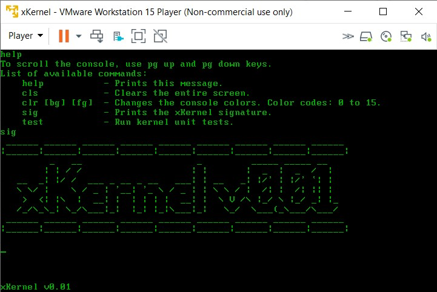

xKernel - a kernel for x86 processors. Why? Because it's fun :)

To install:
make packages

To run:
make run

To debug (with gdb):
make debug

To run unit tests:
make test

To create disk image:
make iso
